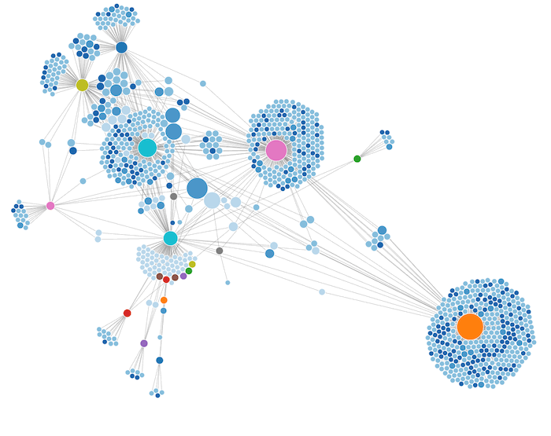
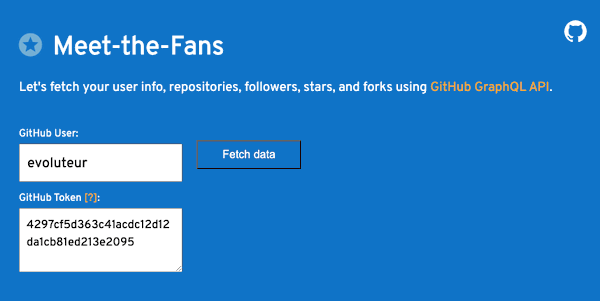
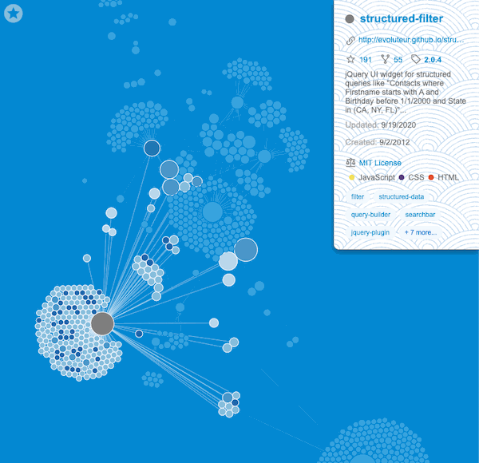

Network graph of repositories, followers, stargazers, and forks to meet your GitHub fans.

[](https://evoluteur.github.io/meet-the-fans/)


## Getting the data

[Get your data](https://evoluteur.github.io/meet-the-fans/index-data.html) (user info, repositories, followers, stars, and forks) using [GitHub GraphQL API](https://docs.github.com/en/free-pro-team@latest/graphql).

[](https://evoluteur.github.io/meet-the-fans/index-data.html)

You will need a [GitHub Access Token](https://docs.github.com/en/free-pro-team@latest/github/authenticating-to-github/creating-a-personal-access-token).


## Visualizing the data

[Visualize your data](https://evoluteur.github.io/meet-the-fans/) using D3 force layout.

[](https://evoluteur.github.io/meet-the-fans/)

You will have to change the path to "data/data-evoluteur.js" for the new file you just downloaded (in [index.html](https://github.com/evoluteur/meet-the-fans/blob/master/index.html)).


Clicking a project on the graph shows its details and highlights it with its stargazers and forks.

[](https://evoluteur.github.io/meet-the-fans/)

The graph can be configured in the [config.js](https://github.com/evoluteur/meet-the-fans/blob/master/config.js) file. You may also want to modify the [CSS](https://github.com/evoluteur/meet-the-fans/blob/master/css/meet-the-fans.css).

```javascript
const config = {
    height: 1600,
    width: 1200,
    strength: -30,
    distance: 50,
    userColors: {
        follower: '#B9D7EB',
        star: '#86BDDC',
        fork: '#1966AC',
        both: '#4A96C9',
    },
    colorFaded: '#e1e1e1',
    circleBorder: 'white',
    maxTopics: 5,
}
```

To rebuild the project (minimizing the JS and CSS), run the following commands:

```javascript
npm install
gulp
```


## License

Meet-the-Fans is released under the [MIT license](http://github.com/evoluteur/meet-the-fans/blob/master/LICENSE).

Copyright (c) 2020 [Olivier Giulieri](https://evoluteur.github.io/).
