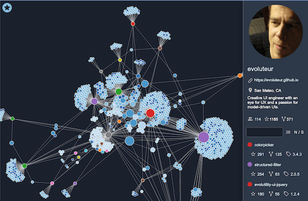
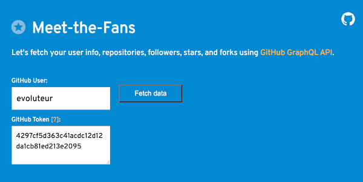
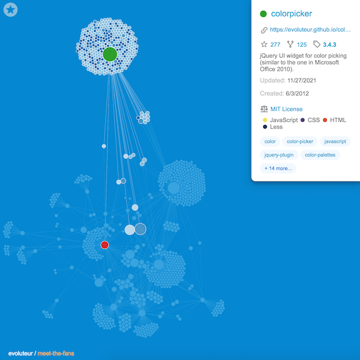

 &middot; [](https://github.com/evoluteur/meet-the-fans/blob/master/LICENSE) [](https://www.npmjs.com/package/meet-the-fans)

Network graph of repositories, followers, stargazers, and forks to meet your GitHub fans.

[](https://evoluteur.github.io/meet-the-fans/)
## Installation

[**Download**](https://github.com/evoluteur/meet-the-fans/archive/master.zip) or **clone** from [GitHub](https://github.com/evoluteur/meet-the-fans/).

```bash
# To get the latest stable version, use git from the command line.
git clone https://github.com/evoluteur/meet-the-fans
```

or use the [npm package](https://www.npmjs.com/package/meet-the-fans):

```bash
# To get the latest stable version, use npm from the command line.
npm install meet-the-fans
```


## Getting the data

[Get your data](https://evoluteur.github.io/meet-the-fans/index-data.html) (user info, repositories, followers, stars, and forks) using [GitHub GraphQL API](https://docs.github.com/en/free-pro-team@latest/graphql).

Open index-data.html in your browser to fetch and download your data easily. Just enter your GitHub user name and your [GitHub Access Token](https://docs.github.com/en/free-pro-team@latest/github/authenticating-to-github/creating-a-personal-access-token), then click the "Fetch data" button.

[](https://evoluteur.github.io/meet-the-fans/index-data.html)

When fetching is done a "Download" button appears. Use it to download your data.
 
Note: it is only fetching original repositories (not including forked repos) but it is easy to change in the code.

## Visualizing the data

[Visualize your data](https://evoluteur.github.io/meet-the-fans/) using D3 force layout.

To switch to your data, change the path to "data/data-evoluteur.js" for the new file you just downloaded (in [index.html](https://github.com/evoluteur/meet-the-fans/blob/master/index.html)).

Clicking a project dot (on the graph or in the side pane) highlights it with its stargazers and forks.

[](https://evoluteur.github.io/meet-the-fans/)

The graph supports zoom and pan. Colors, size and force layout can be configured in the [config.js](https://github.com/evoluteur/meet-the-fans/blob/master/config.js) file. You may also want to modify the [CSS](https://github.com/evoluteur/meet-the-fans/blob/master/css/meet-the-fans.css).

```javascript
const config = {
  height: 1600,
  width: 1200,
  strength: -30,
  distance: 50,
  userColors: {
    follower: "#B9D7EB",
    star: "#86BDDC",
    fork: "#1966AC",
    both: "#4A96C9",
  },
  colorFaded: "#e1e1e1",
  circleBorder: "white",
  maxTopics: 5,
};
```

To rebuild the project (minimizing the JS), run the following commands:

```javascript
npm install
npm run build
```

## License

Meet-the-Fans is released under the [MIT license](http://github.com/evoluteur/meet-the-fans/blob/master/LICENSE).

Encourage this project by [becoming a sponsor](https://github.com/sponsors/evoluteur).

## More...

Check out my other project [GitHub-Projects-Cards](https://github.com/evoluteur/github-projects-cards) for a [Cards view](https://evoluteur.github.io/github-projects-cards/) of your Github projects.


Copyright (c) 2026 [Olivier Giulieri](https://evoluteur.github.io/).
